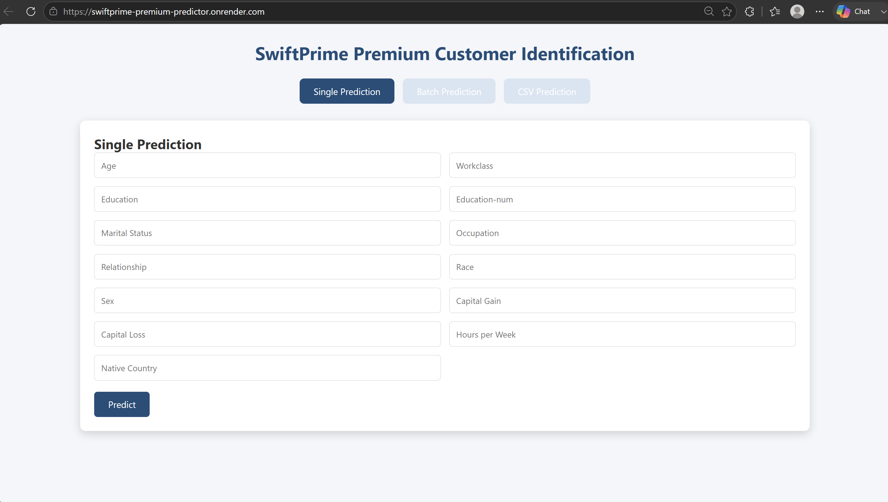
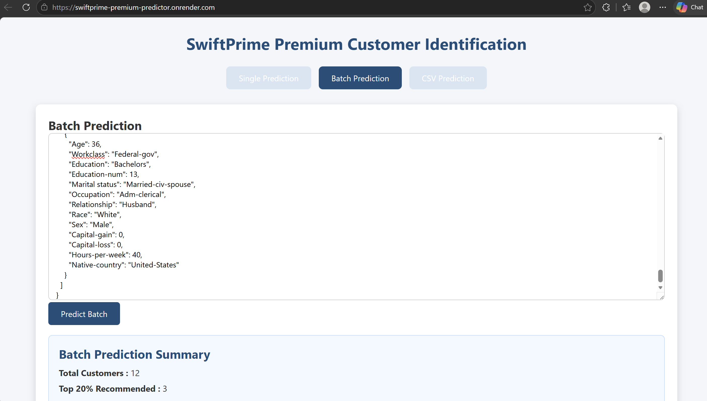
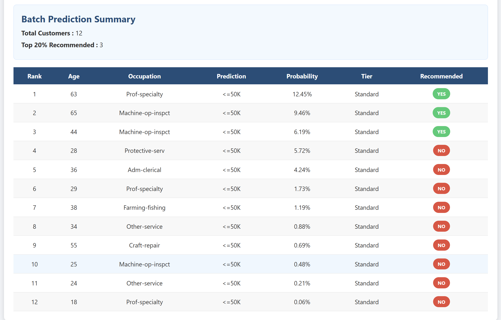
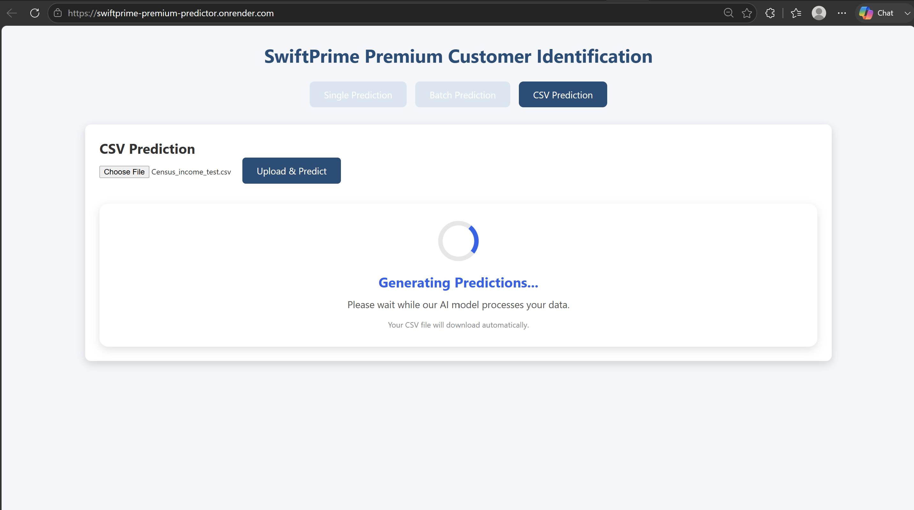

# SwiftPrime Premium Customer Identification

An end-to-end Machine Learning application that predicts whether a customer belongs to the premium income segment (>50K) using demographic and employment information.


🚀 Live Demo

👉 **[Click here to try the Live Demo](https://swiftprime-premium-predictor.onrender.com/)**

**Live URL:** https://swiftprime-premium-predictor.onrender.com/

---

## 🏠 Home Page



##  👥 Batch Prediction

!Predict multiple customers at once using JSON input.




## 📄 CSV Prediction

Upload a CSV file and automatically download the prediction results.



---

The project includes:

- Data preprocessing
- Feature engineering
- Classification models
- FastAPI
- Interactive Web UI
- Batch prediction support
- CSV upload prediction

---

## Project Structure

```
UP-Analytics-2026-Assessment--Venkata-Rosi-Reddy-Jakkireddy/
│
├── App1.py
├── xgboost_swiftprime_model.pkl
├── label_encoders.pkl
├── requirements.txt
├── README.md
│
├── templates/
│   └── index.html
│
├── static/
│   ├── style.css
│   └── script.js
│
└── dataset/
```

---

## Project Features

- Predict premium customers
- Probability score
- Priority Tier assignment
- Single customer prediction
- Batch JSON prediction
- CSV prediction
- Automatic feature engineering
- Missing value handling
- Responsive web interface

---

## Machine Learning Pipeline

### Data Cleaning

- Missing values replaced using mode
- Unknown values (`?`) handled
- Feature encoding

### Feature Engineering

Additional engineered features:

- Capital Net
- Capital Activity
- Log Capital Gain
- Log Capital Loss
- Married Flag
- High Skill Occupation
- Self Employed
- Age Group
- Education Group

### Model

- Random Forest, Logistic Regression, XGBoost Classifier

Performance:

- Accuracy: **87.35%**

---

## API Endpoints

### Home

```
GET /
```

Returns the web application.

---

### Predict Single Customer

```
POST /predict
```

Returns

```json
{
    "prediction": ">50K",
    "probability": 0.9234,
    "priority_tier": "Diamond",
    "recommended": true
}
```

---

### Batch Prediction

```
POST /predict/batch
```

Accepts multiple customer records.

Returns

- Prediction
- Probability
- Rank
- Priority Tier
- Recommendation

---

### CSV Prediction

```
POST /predict/csv
```

Upload a CSV file and receive a downloadable prediction CSV.

---

## Priority Tier Logic

| Probability | Tier |
|------------|---------|
| ≥ 0.85 | Diamond |
| ≥ 0.70 | Platinum |
| ≥ 0.50 | Gold |
| ≥ 0.30 | Silver |
| < 0.30 | Standard |

---

## Installation

Clone repository

```bash
git clone https://github.com/yourusername/UP-Analytics-2026-Assessment--Venkata-Rosi-Reddy-Jakkireddy.git
```

Move into project

```bash
cd UP-Analytics-2026-Assessment--Venkata-Rosi-Reddy-Jakkireddy
```

Create virtual environment

```bash
python -m venv venv
```

Activate

Windows

```bash
venv\Scripts\activate
```

Linux / Mac

```bash
source venv/bin/activate
```

Install packages

```bash
pip install -r requirements.txt
```

---

## Run Application

```bash
python App1.py
```

Open

```
http://127.0.0.1:8000
```

---

## Required Model Files

Place the following files in the project root.

```
xgboost_swiftprime_model.pkl

label_encoders.pkl
```

---

## Technologies Used

- Python
- FastAPI
- XGBoost
- Pandas
- NumPy
- Scikit-learn
- Joblib
- Jinja2
- HTML
- CSS
- JavaScript

---

## Author

**Venkata Rosi Reddy Jakkireddy**
